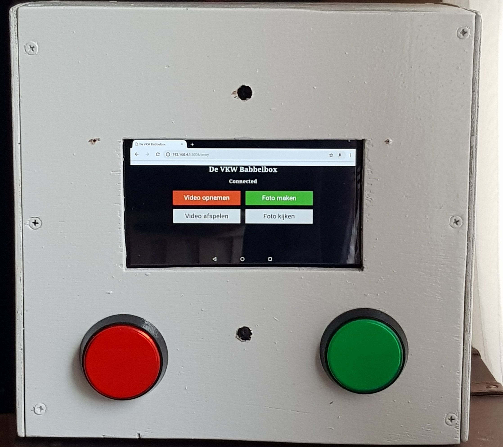

# VideoboothRPi
Python3 app to be used on the Raspberry Pi (3) to record video or take a photo

Web (based on Flask) and Tkinter fronted support.

The program is intended to be run on a Raspberry Pi. In my case an Rpi3b+

Functionality:

When user presses a web button or GPIO button 'Video Opnemen' it will record a video with audio and copy it to a mounted usb drive
When user presses a web button or GPIO button 'Foto maken' a photo will be taken.
Support for playing the last video is supported via Web or Tkinter interface

User can not delete a file

The base is the Picam library: https://github.com/iizukanao/picam
Reason for this is that it produces a synchronized mp4 Video/Audio file which proved to be a challenge on the Raspberry pi
This Picam is run as a service as shown in the repository.

For taking a Picture, i used the standard Raspistill command, since that is not supported in Picam.
For it to work the picam service is temporarily stopped and restarted after taking the picture.

Prerquesites:
- picam installed and setup to run as a service : https://github.com/iizukanao/picam
- camera of pi installed
- In my case , i use an old USB webcam for Audio. (alsadev) 
- Mount USB Drive: sudo mount -o uid=pi,gid=pi /dev/sda1 /mnt/data/
- link from static directory to /mnt/... (ln -l ..)
Since I want to use this when not being connected to internet, I need to do the following:
- at startup: set the correct date : sudo date -s '2017-02-05 15:30:00' (since the pi will reset time at every poweroff)
- start the service: /usr/bin/python3 /home/pi/Videobooth/Web_videobooth.py
- Connect to wifi : vkwvideobooth
- open 192.168.4.1:5006 (or other port if mentioned on startup)

Example:

Challenges that I had to tackle:
1. Audio and Video sync => as a result I choose for using picam which solved that problem
2. Correct start of Picam as a service: /home/pi/picam/picam --quiet --fps 30 --alsadev hw:1,0 --samplerate 16000 --hlsdir /run/shm/hls
3.convert video : os.system(' ffmpeg -i ' + lastfile + ' -c:v copy -c:a copy -bsf:a aac_adtstoasc ' + os.path.splitext(lastfile)[0]+'.mp4')
4. Websocket support: when using flask I could not get it up and running. Using gevent it worked.

